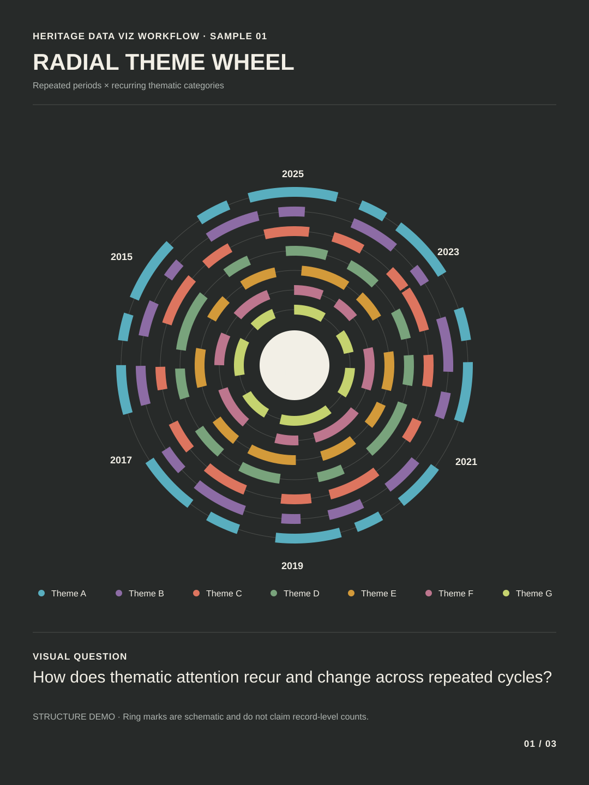
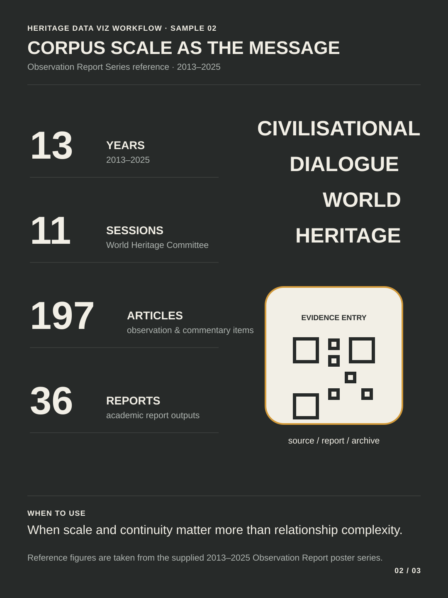
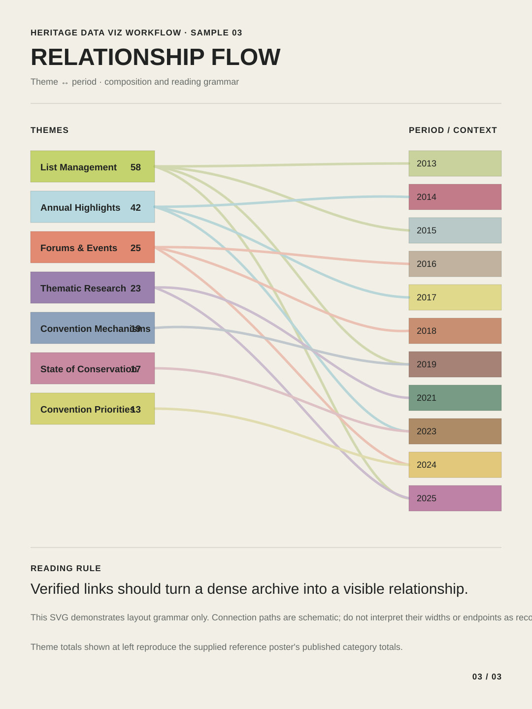
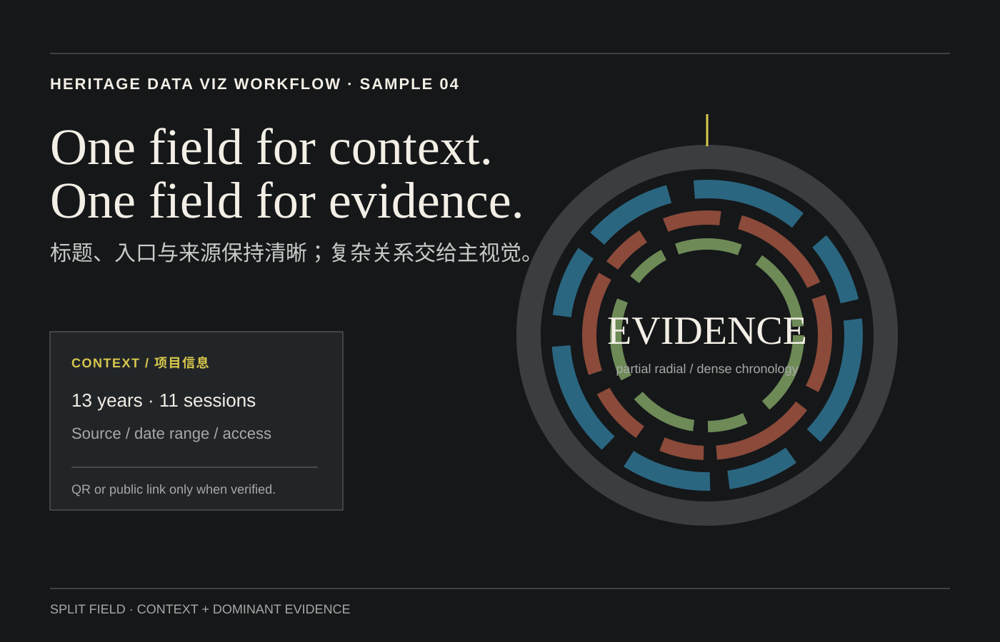
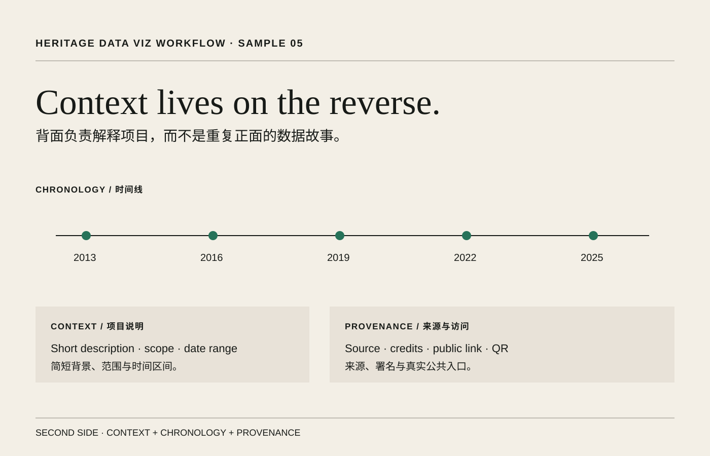

# Examples

These files demonstrate the visual grammar encoded by the Skill. They are deterministic SVGs intended to show **how the same research corpus can be framed through different evidence questions**.

## 01 · Radial wheel

A schematic grammar sample for repeated periods × thematic categories. The ring marks are intentionally labelled as a structure demo rather than a record-level reconstruction.

Use this family when chronology and recurring categories need to be read together.

## 02 · Metric summary

A corpus-scale summary based on the supplied Observation Report Series reference: 2013–2025, 11 World Heritage Committee sessions, 197 observation/commentary items, and 36 reports.

Use this family when scale and continuity are the main message.

## 03 · Relationship flow

A schematic relationship-layout sample inspired by the supplied theme-to-host-year poster. It demonstrates the composition and reading grammar without claiming record-level link weights.

Use this family only when the underlying source-target-value table has been verified.

## 04 · Split field

A layout grammar for pairing a strong context/provenance field with one dense evidence visual.

Use this family when a poster needs both a clear project entry point and a complex radial or temporal graphic.

## 05 · Context back

A second-side grammar for chronology, provenance, credits and public access information.

Use this family when the front carries the visual argument and the reverse side needs to explain the project without repeating the main graphic.

---

## Important

The reference project uses real research data. A visual grammar sample is not a substitute for the source table.

Before producing a publishable Sankey, radial wheel, or network, run the full Skill workflow and preserve the structured evidence table used to generate every mark.
